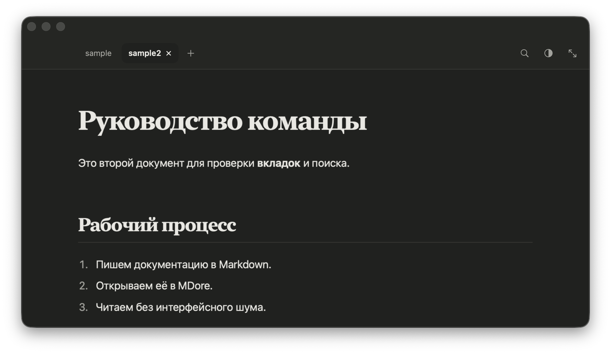
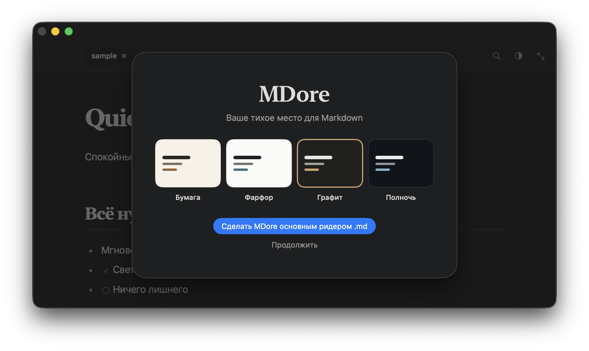
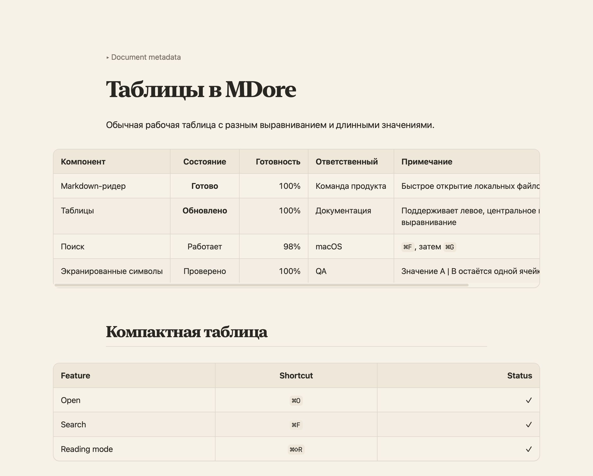

# MDore

[English version](README.md)

[](https://github.com/Mikarmk/MDear/actions/workflows/ci.yml)
[](https://github.com/Mikarmk/MDear/releases/latest)

**Спокойный нативный ридер Markdown для macOS.**

MDore открывает Markdown как документ, а не как код. Он подходит для спецификаций, протоколов встреч, инструкций, документации и README, которые хочется читать вне IDE.



## Скачать

Готовые файлы находятся в разделе [GitHub Releases](https://github.com/Mikarmk/MDear/releases/latest):

- **MDore-macOS.dmg** — рекомендуемый установщик;
- **MDore-macOS.zip** — архив с приложением.

Требуется macOS 14 или новее. Поддерживаются Apple Silicon и Intel.

## Установка

1. Скачайте и откройте `MDore-macOS.dmg`.
2. Перетащите **MDore** в папку **Applications / Программы**.
3. При первом запуске нажмите по MDore с Control и выберите **Открыть**.
4. Выберите тему и при желании назначьте MDore основным приложением для `.md`.

Первая публичная версия подписана ad-hoc, но не нотарифицирована Apple. Поэтому macOS может один раз потребовать запуск через Control-клик → «Открыть».



## Возможности

- Нативное приложение SwiftUI без Electron.
- Несколько документов в компактных вкладках.
- Темы «Бумага», «Фарфор», «Графит» и «Полночь».
- Автоматическое обновление открытого документа после сохранения в другом приложении.
- Автоматическое скрытие интерфейса при прокрутке.
- Полноэкранное чтение с учётом области камеры MacBook.
- Поиск, адаптивные GFM-таблицы, локальные ссылки и изображения, списки задач и блоки кода.
- MDore никогда не изменяет открытые документы.
- Нет аккаунтов, телеметрии и сетевых запросов.

### Таблицы как часть документа

MDore 1.1 корректно отображает GFM-таблицы: учитывает выравнивание колонок, аккуратно распределяет пространство и добавляет локальную горизонтальную прокрутку только для действительно широких данных.



## Горячие клавиши

| Действие | Сочетание |
| --- | --- |
| Открыть файлы | `⌘O` |
| Закрыть вкладку | `⌘W` |
| Обновить текущий документ | `⌘R` |
| Поиск | `⌘F` |
| Следующее совпадение | `⌘G` |
| Режим чтения | `⌘⇧R` |
| Размер текста | `⌘+` / `⌘−` |
| Исходный размер | `⌘0` |

## Сборка из исходников

```bash
git clone https://github.com/Mikarmk/MDear.git
cd MDear
make build
```

Команда создаст приложение, ZIP и DMG:

```text
build/MDore.app
dist/MDore-macOS.zip
dist/MDore-macOS.dmg
```

## Лицензия

[MIT](LICENSE)
